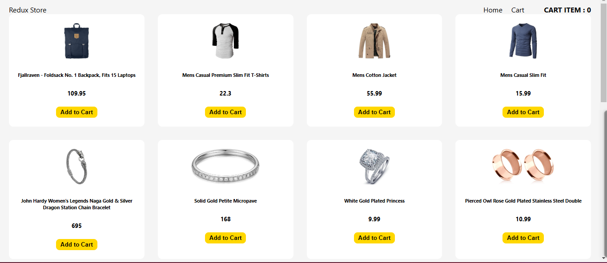
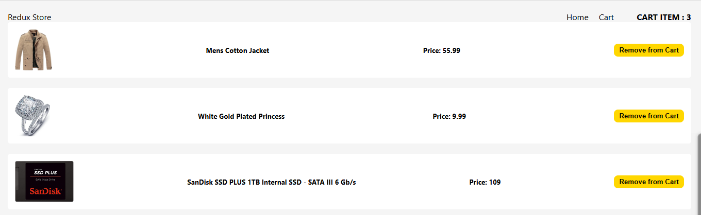

# Shopping Cart App

This is a simple e-commerce shopping cart application built with ReactJS, Redux, and `react-router-dom`. The app fetches a list of items from the [Fake Store API](https://fakestoreapi.com/) and allows users to add or remove items from their cart. It features complex state management using Redux and asynchronous data fetching with Redux Thunk.

## 📸 Preview




## 🌟 Features

- **Browse Products**: Loads a list of items from Fake Store API.
- **Add to Cart**: Users can add products to their cart.
- **Remove from Cart**: Users can remove items from their cart.
- **State Management with Redux**: Handles complex state efficiently.
- **Asynchronous Data Fetching**: Uses Redux Thunk to fetch items from an API.

## 🛠️ Technologies Used

- **ReactJS**: For building the user interface.
- **Redux**: For state management.
- **Redux Thunk**: For handling asynchronous actions.
- **React Router DOM**: For navigating between pages.
- **JavaScript (ES6+)**: Core language for logic and interactivity.

## 📂 Project Structure

```plaintext
project-root/
├── public/
│   ├── index.html
├── src/
│   ├── components/
│   │   ├── Navbar/
│   │   ├── ProductList/
│   │   ├── Cart/
│   ├── redux/
│   │   ├── store.js
│   │   ├── slices/
│   │       ├── cartSlice.js
│   │       ├── productSlice.js
│   ├── App.js
│   ├── index.js
│   ├── styles/
│       ├── global.css
│   └── assets/ (for images, icons, etc.)
├── .gitignore
├── package.json
└── README.md
```

## 🚀 Getting Started

To run this project locally, follow these steps:

### Prerequisites

Ensure you have [Node.js](https://nodejs.org/) installed.

### Installation

1. Clone this repository:
   ```bash
   git clone https://github.com/your-username/cart-app.git
   ```
2. Navigate to the project directory:
   ```bash
   cd cart-app
   ```
3. Install dependencies:
   ```bash
   npm install
   ```

### Running the Project

```bash
npm start
```

The app should now be running on [http://localhost:3000](http://localhost:3000).

## 🧪 Testing the API

This app uses the Fake Store API for product data. You can check out the API documentation here: [Fake Store API Documentation](https://fakestoreapi.com/docs).

## 📬 Contact

Feel free to reach out for questions or collaboration via [your-email@example.com](mailto:your-email@example.com).

